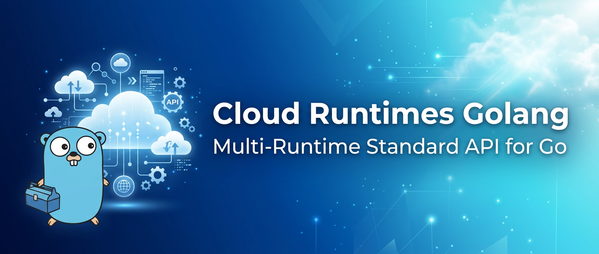
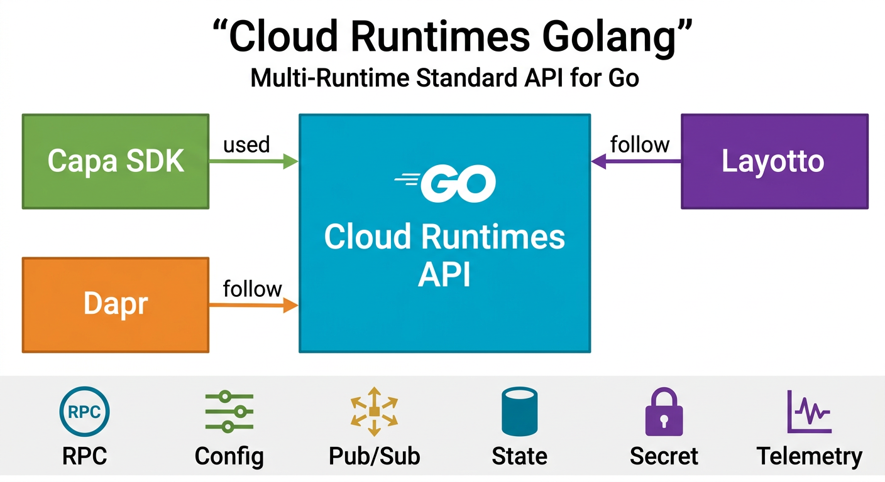
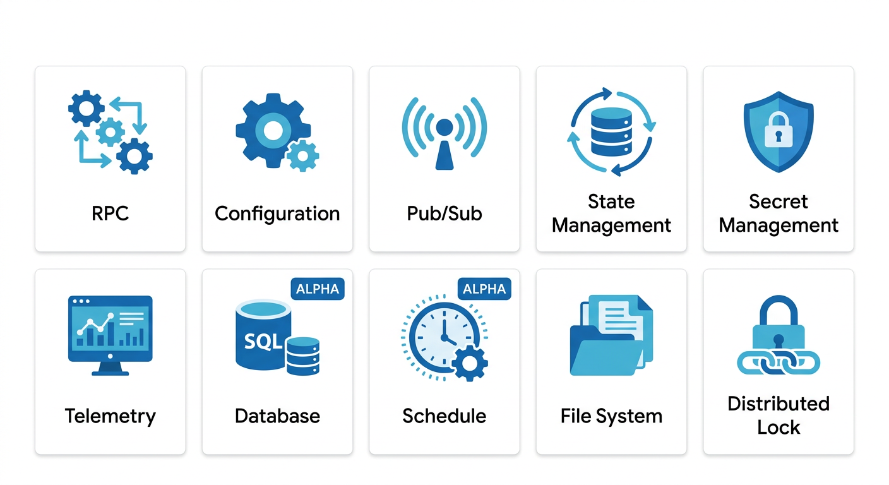

<p align="center">
  
</p>

<h1 align="center">Cloud Runtimes Golang</h1>

<p align="center">
  <strong>Multi-Runtime Standard API for Go</strong>
</p>

<p align="center">
  <a href="https://github.com/capa-cloud/capa">Capa</a> ·
  <a href="https://dapr.io/">Dapr</a> ·
  <a href="https://github.com/mosn/layotto">Layotto</a>
</p>

<p align="center">
  
  
</p>

---

## 📖 Introduction

**Cloud Runtimes Golang** provides the **Multi-Runtime Standard API** for Mecha architecture projects in Go.

This project defines a unified, vendor-neutral API specification that enables Go applications to use standardized interfaces for distributed system capabilities across different runtime implementations.

### Supported Runtimes

| Runtime | Status | Description |
|---------|--------|-------------|
| [Capa](https://github.com/capa-cloud/capa) | ✅ Used | Primary Mecha SDK implementation |
| [Dapr](https://dapr.io/) | 📋 Follow | Sidecar runtime reference |
| [Layotto](https://github.com/mosn/layotto) | 📋 Follow | MOSN-based sidecar implementation |

---

## 🏗️ Architecture

<p align="center">
  
</p>

### Module Structure

```
cloud-runtimes-golang/
├── api/                    # Core API definitions (interfaces)
│   ├── rpc/
│   ├── configuration/
│   ├── pubsub/
│   ├── state/
│   ├── secret/
│   └── telemetry/
└── go.mod                  # Go module definition
```

**Key Design Principles:**
- **API-First**: Clean interfaces separate specification from implementation
- **Runtime Agnostic**: Works with Capa SDK, Dapr, Layotto, and future runtimes
- **Idiomatic Go**: Follows Go best practices and patterns
- **Vendor Neutral**: No lock-in to specific cloud providers

---

## ✨ Features

<p align="center">
  
</p>

### Stable Features

| Feature | Interface | Description | Status |
|---------|-----------|-------------|--------|
| 🔗 **Service Invocation** | `RpcService` | RPC service-to-service communication | ✅ Stable |
| ⚙️ **Configuration** | `ConfigurationService` | Dynamic configuration management | ✅ Stable |
| 📨 **Pub/Sub** | `PubSubService` | Publish/Subscribe messaging | ✅ Stable |
| 💾 **State Management** | `StateService` | Key-value state storage | ✅ Stable |
| 🔐 **Secret Management** | `SecretService` | Secure secret retrieval | ✅ Stable |
| 📊 **Telemetry** | `TelemetryService` | Logs, metrics, and traces | ✅ Stable |
| 📁 **File System** | `FileService` | File storage operations | ✅ Stable |
| 🔒 **Distributed Lock** | `LockService` | Distributed locking | ✅ Stable |

### Alpha Features

| Feature | Interface | Description | Status |
|---------|-----------|-------------|--------|
| 🗄️ **Database** | `DatabaseService` | SQL database operations | 🔬 Alpha |
| ⏰ **Schedule** | `ScheduleService` | Scheduled task management | 🔬 Alpha |

---

## 🎯 Motivation

Cloud Runtimes Golang was created to bring standardized, portable APIs to the Go ecosystem:

- **[Future plans for Dapr API](https://github.com/dapr/dapr/issues/2817)** - Community discussion on API standardization
- **[Make SDK independent](https://github.com/mosn/layotto/issues/188)** - Decoupling API from implementation
- **[Decompose core and enhanced APIs](https://github.com/dapr/dapr/issues/3600)** - API layering strategy

---

## 🚀 Getting Started

### Installation

```bash
go get github.com/capa-cloud/cloud-runtimes-golang/api
```

### Quick Example

```go
package main

import (
    "context"
    "log"

    "github.com/capa-cloud/cloud-runtimes-golang/api"
)

func main() {
    // Create a runtime client (implementation-specific)
    client := api.NewClient()

    // Use the RPC service
    resp, err := client.Rpc().InvokeMethod(context.Background(), "service-name", "method", data)
    if err != nil {
        log.Fatal(err)
    }

    // Use the State service
    err = client.State().Save(context.Background(), "state-store", state)
    if err != nil {
        log.Fatal(err)
    }
}
```

### Runtime Implementations

Choose your runtime implementation:

```bash
# For Capa SDK
go get github.com/capa-cloud/cloud-runtimes-capa

# For Dapr
go get github.com/capa-cloud/cloud-runtimes-dapr

# For Layotto
go get github.com/capa-cloud/cloud-runtimes-layotto
```

---

## 📚 API Interfaces

### Service Invocation

```go
type RpcService interface {
    InvokeMethod(ctx context.Context, service, method string, data []byte) ([]byte, error)
    InvokeMethodWithContent(ctx context.Context, service, method string, contentType string, data []byte) ([]byte, error)
}
```

### Configuration

```go
type ConfigurationService interface {
    GetConfiguration(ctx context.Context, storeName string, keys []string) (map[string]string, error)
    SubscribeConfiguration(ctx context.Context, storeName string, keys []string) (<-chan ConfigurationEvent, error)
}
```

### State Management

```go
type StateService interface {
    Get(ctx context.Context, storeName, key string) ([]byte, error)
    Save(ctx context.Context, storeName string, states []StateItem) error
    Delete(ctx context.Context, storeName, key string) error
}
```

---

## 🌐 Ecosystem

Cloud Runtimes Golang is part of the broader Capa Cloud ecosystem:

| Project | Language | Description |
|---------|----------|-------------|
| [cloud-runtimes-jvm](https://github.com/capa-cloud/cloud-runtimes-jvm) | Java | JVM API specification |
| [cloud-runtimes-python](https://github.com/capa-cloud/cloud-runtimes-python) | Python | Python API specification |
| [capa-go](https://github.com/capa-cloud/capa-go) | Go | Go SDK implementation |

---

## 🤝 Contributing

We welcome contributions from the Go community!

1. Fork the repository
2. Create your feature branch (`git checkout -b feature/amazing-feature`)
3. Commit your changes (`git commit -m 'Add amazing feature'`)
4. Push to the branch (`git push origin feature/amazing-feature`)
5. Open a Pull Request

### Development Setup

```bash
# Clone the repository
git clone https://github.com/capa-cloud/cloud-runtimes-golang.git
cd cloud-runtimes-golang

# Download dependencies
go mod download

# Run tests
go test ./...
```

---

## 📜 License

This project is licensed under the Apache License 2.0 - see the [LICENSE](LICENSE) file for details.

---

<p align="center">
  <strong>Building portable, vendor-neutral cloud APIs for Go</strong>
</p>

<p align="center">
  <a href="https://github.com/capa-cloud">Capa Cloud</a> ·
  <a href="https://capa-cloud.github.io/capa.io/">Documentation</a>
</p>
